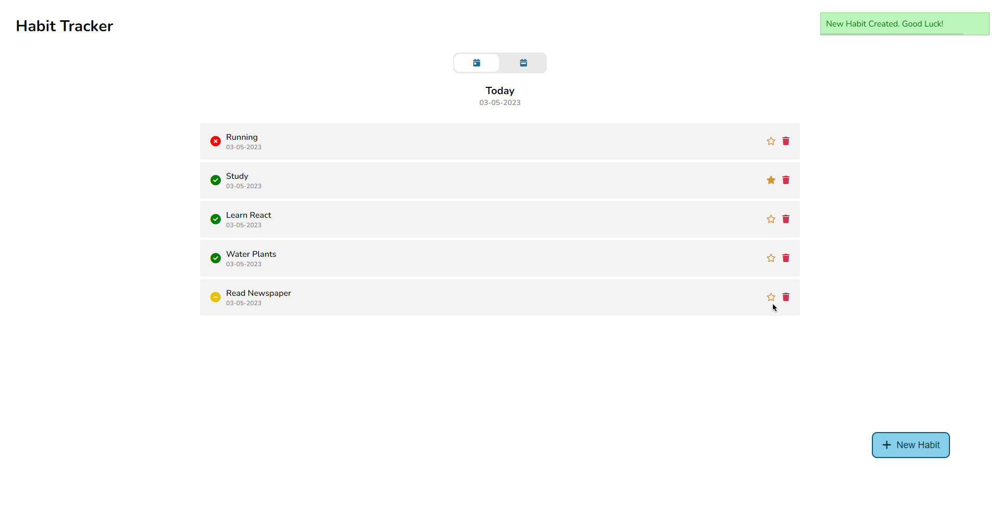
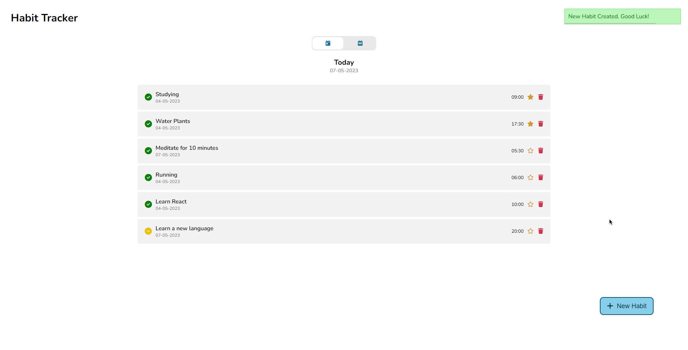
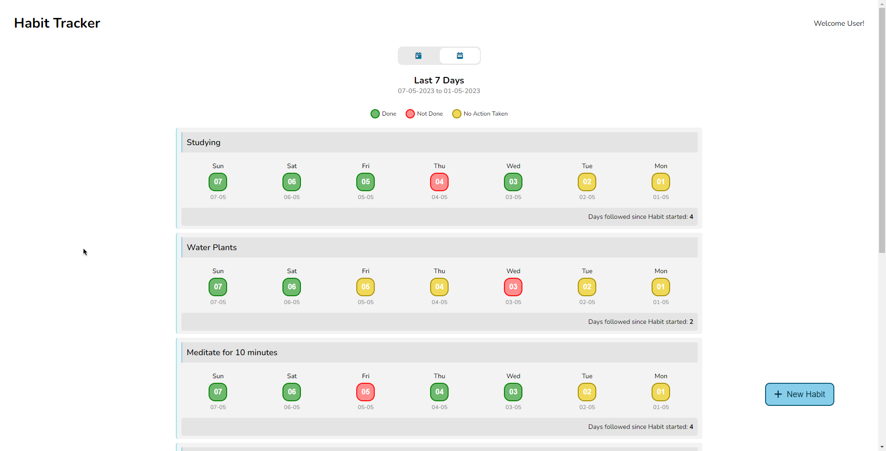

Full Stack Habit Tracker App.

## Table of contents

- [Links](#links)
- [Overview](#overview)
- [Screenshot](#screenshot)
- [Built with](#built-with)
- [To run the app on Local Server](#to-run-the-app-on-local-server)
- [Folder Structure](#folder-structure)
- [Author](#author)

### Links

- Live Site URL: [Live Site URL here](https://habittrackerapp-sjmd.onrender.com/)

### Overview

- This is a Full Stack Habit Tracker app helps to create and track habits. And it has two views, Daily view and Last 7 Days view to get a better idea on how you are progressing with your habits.

### Screenshot

### Built with

- NodeJS
- Express
- EJS
- MongoDB
- SCSS/SASS

### To run the app on Local Server

- Must have NodeJs and MongoDB installed.
- Install all needed npm dependencies from package.json.
- "npm start" (or) "npm run dev" if you need to compile sass files.
- Server should run on "http://localhost:8000/".

## Folder Structure

habit tracker  
├───assets  
│ ├───css  
│ ├───images  
│ ├───js  
│ └───scss  
├───config  
├───controllers  
├───models  
├───routes  
└───views  

## Author

Geoffrey
